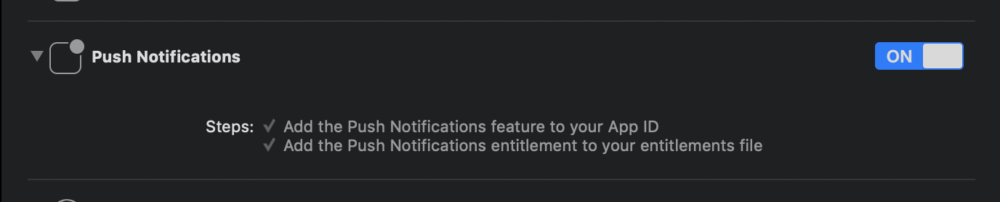

# plain_notification_token

Get your push notification token via platform way (APNs for iOS &#x2F; Firebase Clound Messaging for Android)

## Getting Started

### Android Integration

To integrate your plugin into the Android part of your app, setup Firebase:

1. Using the [Firebase Console](https://console.firebase.google.com/) add an Android app to your project:
Follow the assistant, download the generated `google-services.json` file and place it inside `android/app`.
2. Modify the `android/build.gradle` file and the `android/app/build.gradle` file to add the Google services plugin as described by the Firebase assistant.

(Please see [this tutorial](https://firebase.google.com/docs/android/setup) if you want.)

### iOS Integration

To integrate your plugin into the iOS part of your app, follow these steps:

1. Generate the certificates from [Apple developer center](https://developer.apple.com/account) for receiving push notifications. (Please see [this article](https://medium.com/@ankushaggarwal/generate-apns-certificate-for-ios-push-notifications-85e4a917d522) if you want the tutorial.)
2. Enable `Push Notification` in `Capabilities` tab in Xcode opening your `ios/Runner.xcworkspace`. 




### Dart/Flutter Integration

From your Dart code, you need to import the plugin and instantiate it:

```dart
import 'package:plain_notification_token/plain_notification_token.dart';

final plainNotificationToken = PlainNotificationToken();
```

To get token, call `getToken()`:

```dart
// (iOS Only) Need requesting permission of Push Notification.
if (Platform.isIOS) {
  plainNotificationToken.requestPermission();
  
  // If you want to wait until Permission dialog close,
  // you need wait changing setting registered. 
  await plainNotificationToken.onIosSettingsRegistered.first;
}

final String token = await plainNotificationToken.getToken();
```

... and use token on your server!!

Token is Base64 stringified APNs token (in iOS) / Firebase Cloud Messaging (FCM) string token (in Android).